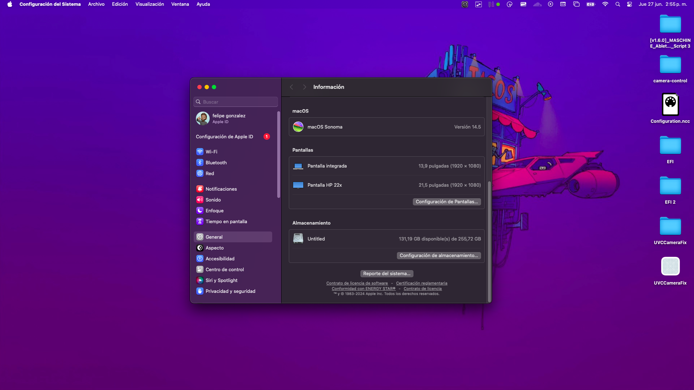
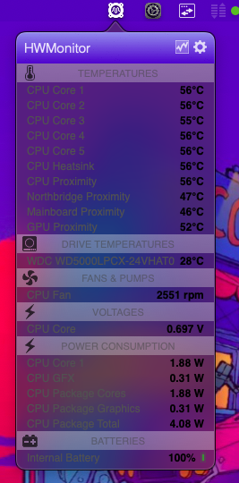
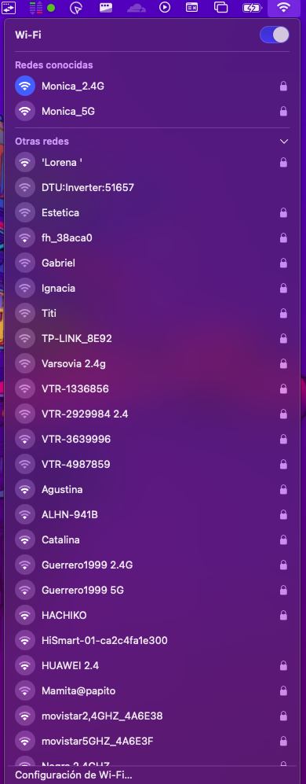
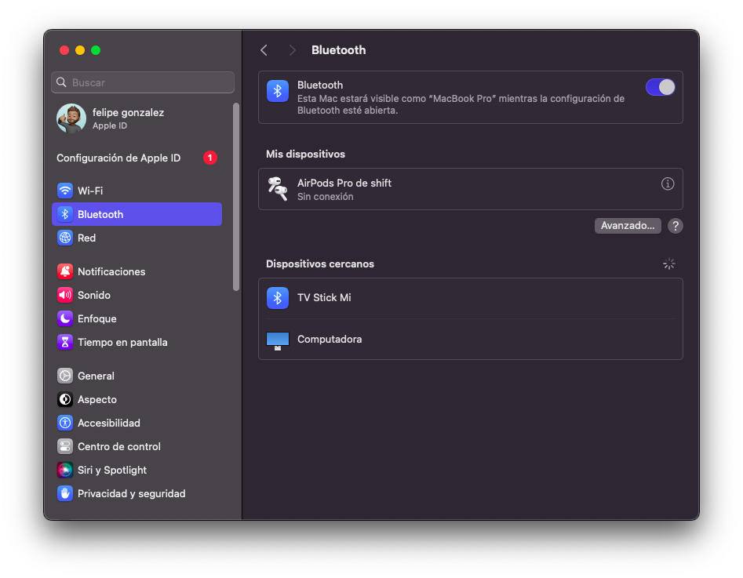

# DELL LATITUDE 3410 HACKINTOSH

-----
Run macOS on your Dell Latitude 3410

**Works fine on Sonoma 14.5 

   
  
   

   
  
   

   
  
   

   
  
   

   
  
   

## Contents

- [Configuration](#configuration)
- [Current Status](#current-status)
  - [OpenCore](#opencore)
- [Installation](#installation)
  - [First-time installation](#first-time-installation)
- [Improvements](#improvements)
- [FAQ](#faq)
- [Changelog](#changelog)
- [A reward](#a-reward)
- [Credits](#credits)
- [Support and discussion](#support-and-discussion)

## Configuration

| Specifications      | Detail                                     |
| ------------------- | -------------------------------------------|
| Computer model      | Dell Latitude 3410                         |
| Processor           | Intel Core i5-10210u Processor             |
| Memory              | 16GB SKHynix DDR4 2666MHz                  |
| Hard Disk           | ADATA 256GB SSD NVME                       |
| Integrated Graphics | Intel UHD Graphics (Spoofed as UHD630)     |
| Sound Card          | Realtek ALC235                             |
| Webcam              | UVC HD Webcam                              |
| Wireless Card       | Intel Wireless AX210                       |
| SD Card Reader      | IDK NEVER USED                             |

## Current Status
- Facetime/iMessage atm only work with ethernet connected. The problem is the itlwm driver and i cannot fixit.
- Everything else works well with the exception of Airdrop (cannot currently work because is not supported by AirportItlwm)
  

## Installation

### First-time installation
- Install with a clean sonoma DMG  and replace the EFI folder with one of mine [releases](https://github.com/fgvilches/DELL-LATITUDE-3410-HACKINTOSH/releases).
- If the trackpad doesn't work during the installation, please plug a wired-wireless mouse before the installation. After the installation completes, open Terminal.app and run sudo kextcache -i /. Wait for the process ending and restart the device. 

- Remember fill with a serial number and board (Use opencore's macserial.py or somthing like that ) on config.plist (Generate a valid serial number an board), because I deleted my SerialNumber an Board for obvious reasons.
  - With that you get Facetime/iMessage Working via ethernet (As of right now it cannot work via wifi because is Intel and is not supported by itlwm)
  
## Improvements
- Use [ALCPlugFix](https://github.com/black-dragon74/ALCPlugFix-Swift) to fix unworking jack after replug.

  

---

Si este proyecto te ha sido util, considera donarme! 
 

   
  
   

 
 

  

  

  
**Cripto** -> 0x537D586a1ae78645D877db2A9215bF68b697D290
_(ETH,BSC,PolyGon)_

